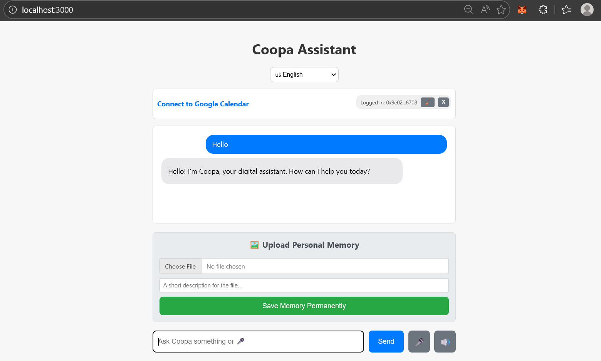
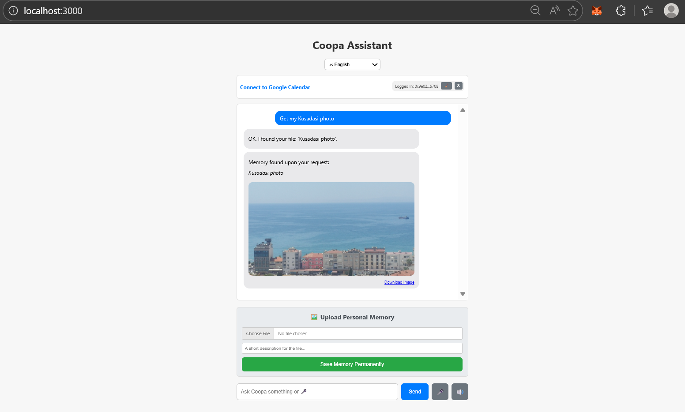

# 🛡️ CoopaAssistant: Your Permanent, AI-Powered Digital Vault

> **"Bridging the gap between AI Intelligence and Data Permanence."**

CoopaAssistant is a sovereign digital assistant that provides users with an encrypted, eternal vault on the **Arweave Permaweb**. By utilizing **Polygon Mainnet** for secure identity and **Google Gemini 3 Flash Preview** for multimodal analysis, CoopaAssistant ensures your memories and data are not just stored, but are searchable and accessible for generations.

---

## 🌐 Live Application

The production version is live and operational at:

👉 **[https://coopaassistant.com/](https://coopaassistant.com/)**

---

## ⚠️ Private Beta & Whitelist Access

To ensure system stability and maximum security during our **Mainnet launch**, CoopaAssistant currently operates in a **Closed Beta** phase.

* **Public Access:** Anyone can view the landing page and connect their wallet for identity verification.
* **Write Access (File Uploads):** Currently restricted to **whitelisted wallet addresses**.
* **Request Access:** If you are a grant reviewer or a beta tester, please send your wallet address to [info@coopaassistant.com](mailto:info@coopaassistant.com) to be added to the whitelist.

---

## 🌟 Key Innovations

* **Semantic Search:** Don't search by filenames. Ask Gemini: *"Find the invoice from my trip to Paris"* or *"Show me the contract I signed last month."*
* **User-Centric Encryption:** Files are encrypted locally using your unique wallet signature. We never see your data; only you hold the keys.
* **Perpetual Storage:** Leveraging Arweave via the **Turbo SDK**, data is stored forever with a one-time fee — no monthly subscriptions.

---

## 🛠️ Technical Architecture

* **AI Engine:** Google Gemini 3 Flash Preview & `text-embedding-004`.
* **Blockchain Identity:** MetaMask (EVM Wallet Signatures) on Polygon.
* **Permanent Layer:** Arweave (via Turbo SDK).
* **Backend/Frontend:** Node.js, Express, HTML5, Vanilla JavaScript.
* **Infrastructure:** Hosted on Render with a custom domain.

---

## 🗺️ Future Roadmap

* [x] **Q1 2026:** Mainnet Launch & Gemini Integration (Current Status).
* [ ] **Q2 2026:** Multi-User System — Multi-user support development.
* [ ] **Q3 2026:** Public Beta Launch — Multi-user beta testing with expanded access.
* [ ] **Q4 2026:** Decentralized Encrypted Sharing (Peer-to-Peer data exchange).

---

## 📬 Contact & Support

**Selçuk Gence** - Founder & Developer

📧 [info@coopaassistant.com](mailto:info@coopaassistant.com)

---

## 📸 Screenshots

*Coopa's greeting in English*

*Weather forecast for London with umbrella suggestion*

*Retrieving stored photo from Arweave permanent storage*

---

*Developed for the future of the Permaweb. Powered by Google AI and Polygon.*
